# Prevendo o comportamento da COVID-19 com Evolução Diferencial e um modelo tipo Maxwell-Boltzmann

  *Analysis of time series datasets of recorded cases and deaths from COVID-19 and recorded cases and deaths from SARS (severe acute respiratory syndrome) in Brazil using Differential Evolution and a combination model of "Maxwell-Boltzmann-like" distributions to forecast the behavior of the first and second wave of COVID-19 in Brazil.*

  Análise de datasets contendo séries temporais de casos e óbitos por COVID-10 registrados e casos e óbitos por SRAG (síndrome respiratória aguda grave) no Brazil utilizando Evolução Diferencial e um modelo combinatório de distribuições tipo Maxwell-Boltzmann para prever o comportamento da primeira e segunda onda de COVID-19 no Brazil.

 **Última atualização: 21/04/2021**

## Sobre ED, Distribuição de Maxwell-Boltzmann e COVID-19:

 Evolução Diferencial é um algorítmo evolutivo simples da categoria de algorítmos meta-heurísticos, que através da criação de populações de soluções, suas seleções e recombinações, é capaz de obter um solução ótima ou aproximadamente ótima para um problema.
 
 Desde que tenhamos dados o suficiente é possível, facilmente, utilizar Evolução Diferencial (Autoadaptativa ou não) para ajustar curvas/séries temporais provenientes de fenômenos físicos, por exemplo. Assim, podemos ajustar curvas geradas por fenômenos antropológicos como os relacionados ao COVID-19, desde que escolhamos um modelo matemáticos conveniente, que possa ser ajustado aos dados.

 A equação de densidade de frequência relativa (distribuição de velocidades de Maxwell-Boltzmann) é um modelo matemático utilizado para determinar a distruibuição de velocidades de moléculas contidas em um gás ideal:
 
 

 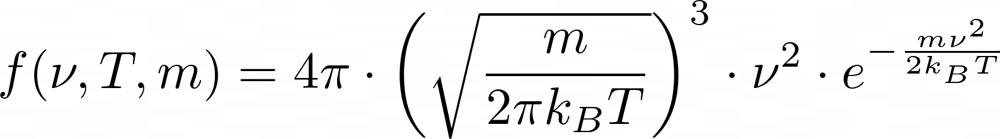
 

 
 Dependendo dos parâmetros escolhidos, massa *m* e temperatura *T*, a função pode esboçar uma clara distruibuição assimétrica (se comparada com uma distruibuição de Gauss) que pode ser capaz de ajustar os dados provenientes da pandemia de COVID-19 no Brasil se associada a um conveniente algoritmo de otimização, já que a distruibuição é capaz de esboçar uma subida abrupta e um comportamento de cauda. 
 
 Assim, foi contruído o seguinte modelo:

 

 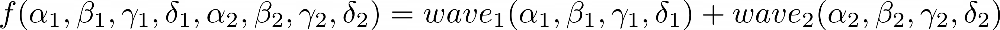
 

 
 Onde:
 
 

 
 

 
 e
 
 

 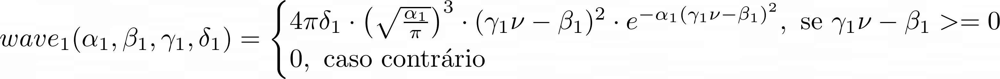
 

 
## Testando o modelo tipo Maxwell-Boltzmann:

*Obs: Este repositório é uma sucessão do trabalho no repositório: https://github.com/adsmendesdaniel/Forecasting-the-COVID-19-behavior-with-Differential-Evolution-and-a-combination-of-gaussians-model, onde testei um outro modelo para ajustar estes mesmo dados.*

Podemos testar o novo modelo encontrando os parâmeros que melhor ajustam a curva gerada pela função aos devidos dados utilizando Evolução Diferencial como algoritmo de otimização, e compara-lo com resultados obtidos por outro modelo. Neste caso, usaremos dados de óbitos por SRAG no Brasil:

 

 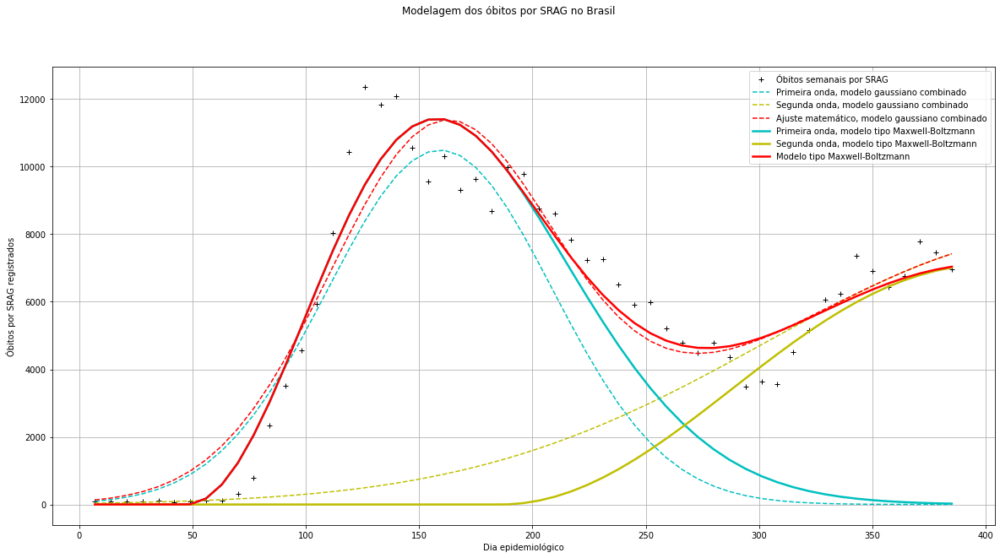
 

O novo modelo (tipo Maxwell-Boltzmann) gerou um erro (RSME) 28.13% menor que o modelo anterior ("Gaussiano combinado").

## Ajustando casos de COVID-19:
 
 Ajuste feito em 05/03/2021 (Melhor de 10 "runs" do algoritmo de ED para o modelo Gaussiano combinado e melhor de 5 runs para o tipo Maxwell-Boltzmann):
 
 

 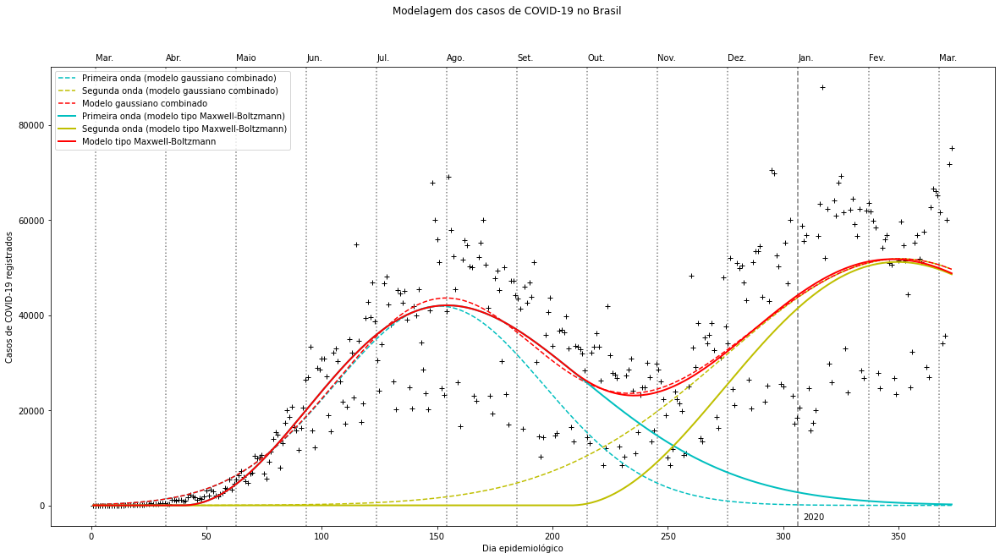
 

 
 **Gráfico atualizado em 21/04/2021:**
 
 

 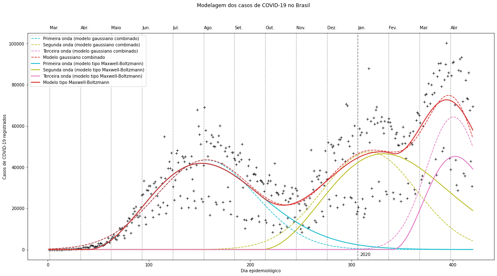
 

 
 Previsão dos próximos dias epidemiológicos feita em 05/03/2021 (Melhor de 10 "runs" do algoritmo de ED para o modelo Gaussiano combinado e melhor de 5 runs para o tipo Maxwell-Boltzmann):
 
 

 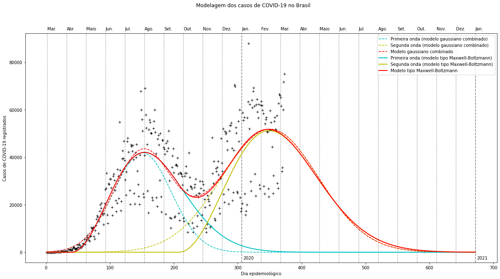
 

 **Gráfico atualizado em 21/04/2021:**

 

 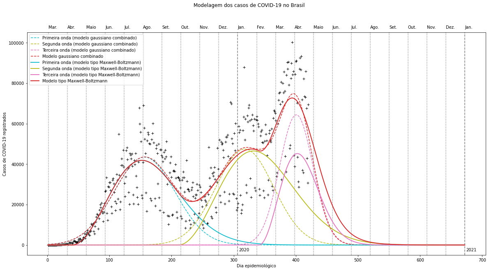
 

 O modelo novo foi 0.16% melhor que o antigo (considerando o erro RSME), neste caso.

## Ajustando óbitos por COVID-19:

 Ajuste feito em 05/03/2021 (Melhor de 10 "runs" do algoritmo de ED para o modelo Gaussiano combinado e melhor de 20 runs para o tipo Maxwell-Boltzmann):
 
 

 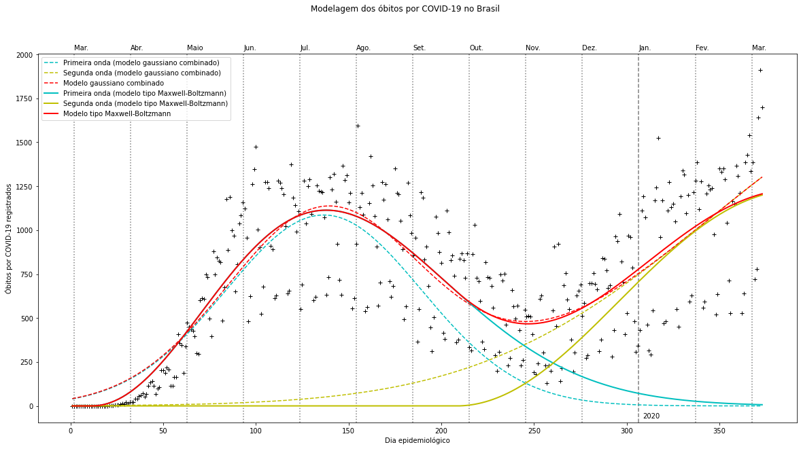
 

 
 **Gráfico atualizado em 21/04/2021:**
 
 

 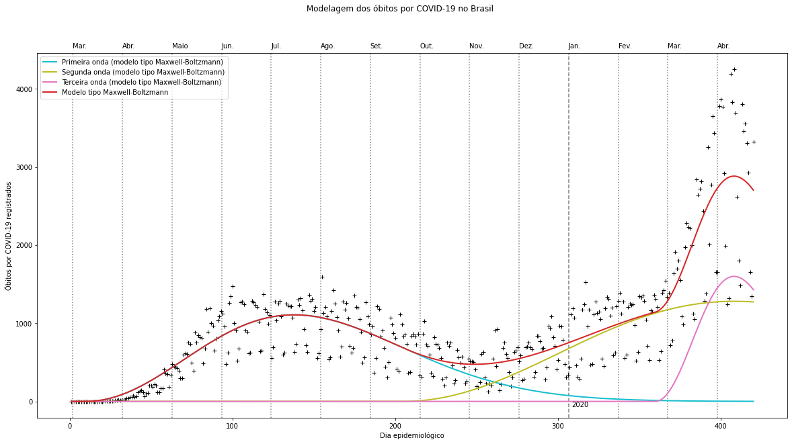
 

 
 Previsão dos próximos dias epidemiológicos feita em 05/03/2021 (Melhor de 10 "runs" do algoritmo de ED para o modelo Gaussiano combinado e melhor de 20 runs para o tipo Maxwell-Boltzmann):
 
 

 
 

 **Gráfico atualizado em 21/04/2021:**

 

 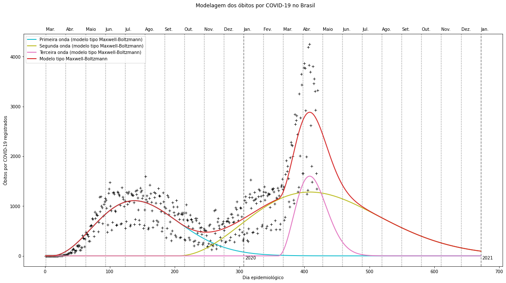
 

 O modelo novo foi 1.99% melhor que o antigo (considerando o erro RSME), neste caso.

## Ajustando casos de SRAG:

 Uma forma de tentarmos prever o comportamento da segunda onda de COVID-19 é analisando os casos e óbitos por Síndrome Respiratória Aguda Grave, já que devido à subnotificação de casos e mortes no Brasil, é possível tentar estimar, por exemplo, óbitos subnotificados por COVID-19 através da análise dos dados de SRAG.

 Ajuste feito em 05/03/2021 (Melhor de 10 "runs" do algoritmo de ED para o modelo Gaussiano combinado e melhor de 10 runs para o tipo Maxwell-Boltzmann):
 
 

 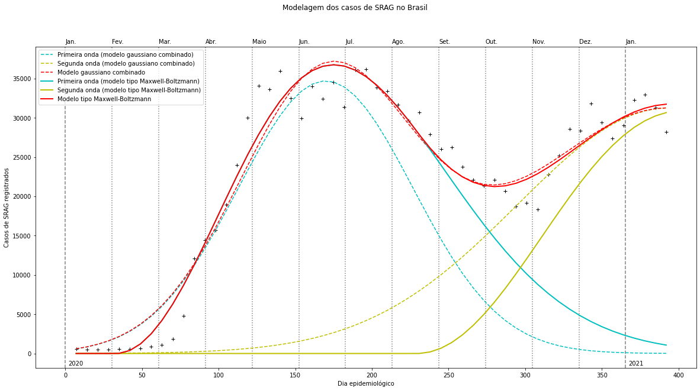
 

 **Gráfico atualizado em 21/04/2021:**

 

 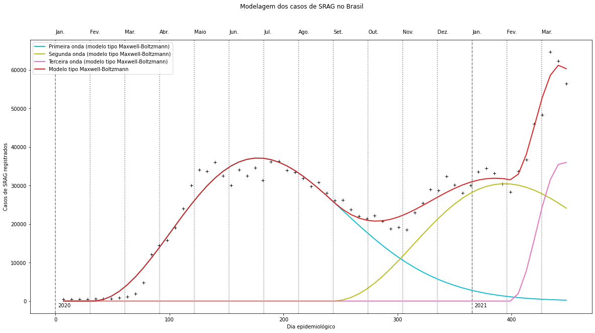
 

 
 Previsão dos próximos dias epidemiológicos feita em 05/03/2021 (Melhor de 10 "runs" do algoritmo de ED para o modelo Gaussiano combinado e melhor de 10 runs para o tipo Maxwell-Boltzmann):
 
 

 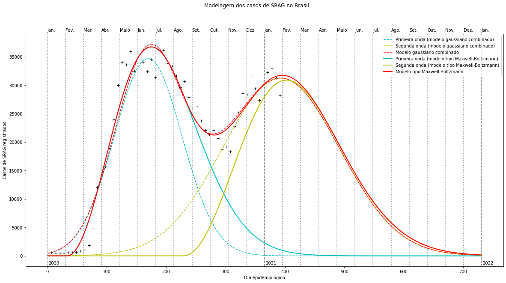
 

 **Gráfico atualizado em 21/04/2021:**

 

 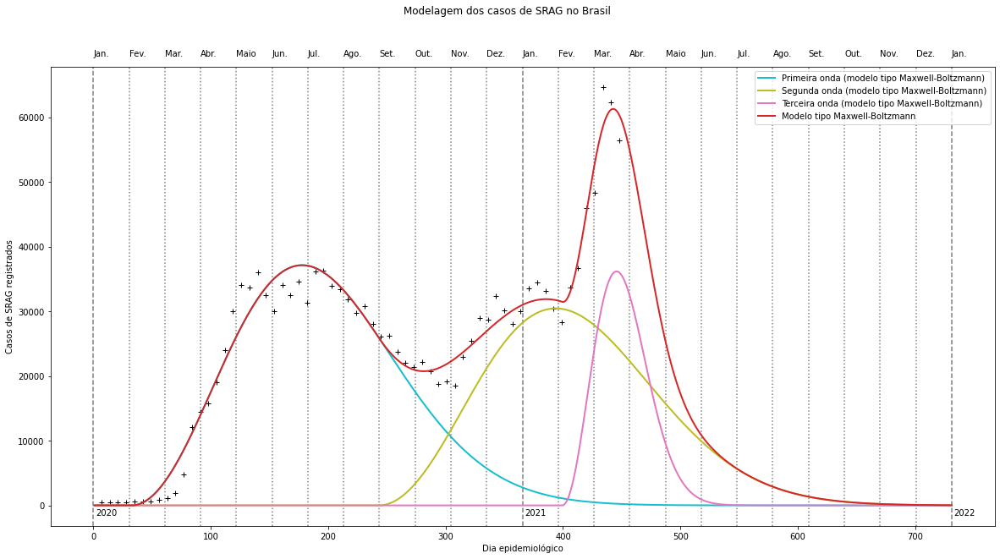
 

 
 O modelo novo foi 15.10% melhor que o antigo (considerando o erro RSME), neste caso.

## Ajustando óbitos por SRAG:
 
 Ajuste atualizado em 05/03/2021 (Melhor de 10 "runs" do algoritmo de ED para o modelo Gaussiano combinado e melhor de 10 runs para o tipo Maxwell-Boltzmann):
 
 

 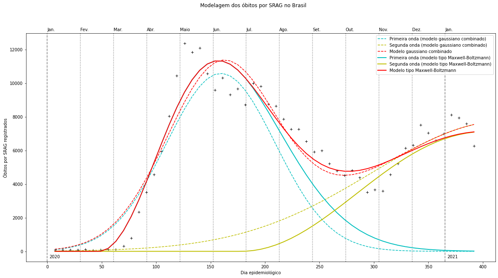
 

 **Gráfico atualizado em 21/04/2021:**

 

 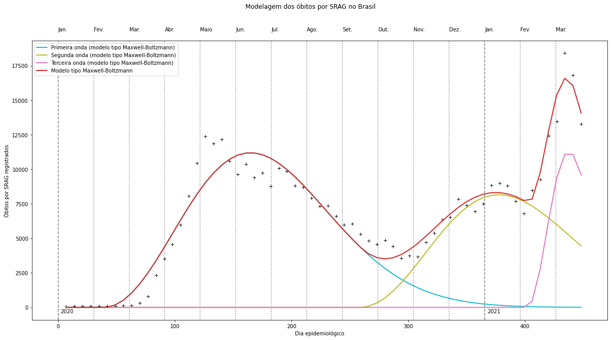
 

 Previsão dos próximos dias epidemiológicos atualizada em 05/03/2021 (Melhor de 10 "runs" do algoritmo de ED para o modelo Gaussiano combinado e melhor de 10 runs para o tipo Maxwell-Boltzmann):
 
 

 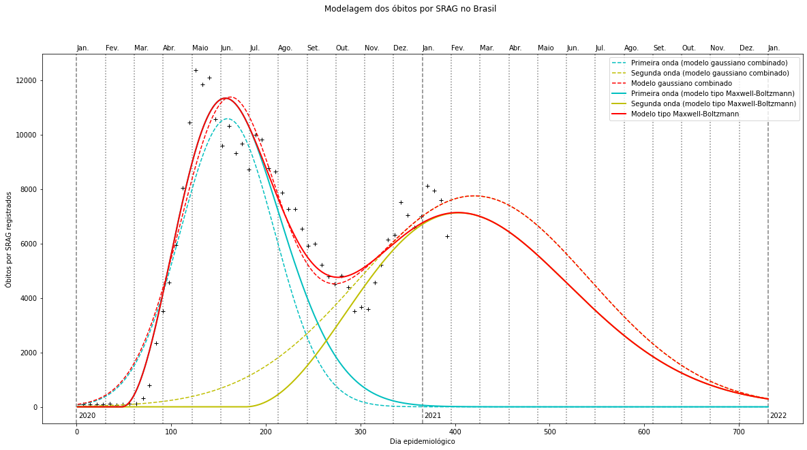
 

 **Gráfico atualizado em 21/04/2021:**

 

 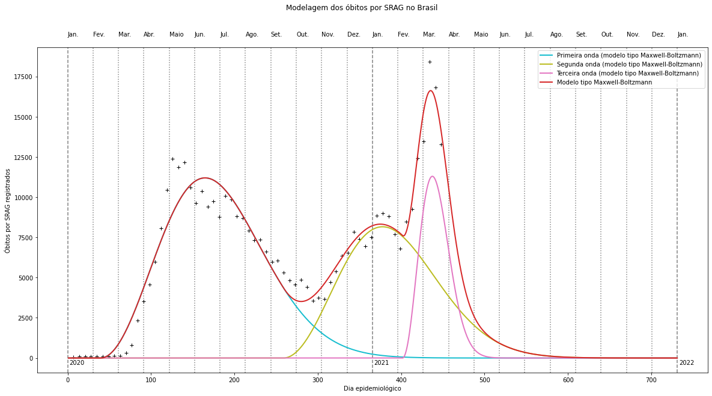
 

 
 O modelo novo foi 17.81% melhor que o antigo (considerando o erro RSME), neste caso.

## Estimativas a partir dos parametros obtidos do modelo ajustado aos dados:
 
 Para tentarmos visualizar o comportamento da segunda onda de COVID-19 no Brasil podemos plotar as curvas correspondentes aos ajustes feitos com o modelo tipo Maxwell-Boltzmann utilizando os parametros obtidos pelo processo de otimização com Evolução Diferencial, e com estas curvas, fazer estimativas baseadas em nosso modelo:

 Normalizações feitas em 05/03/2021:

 

 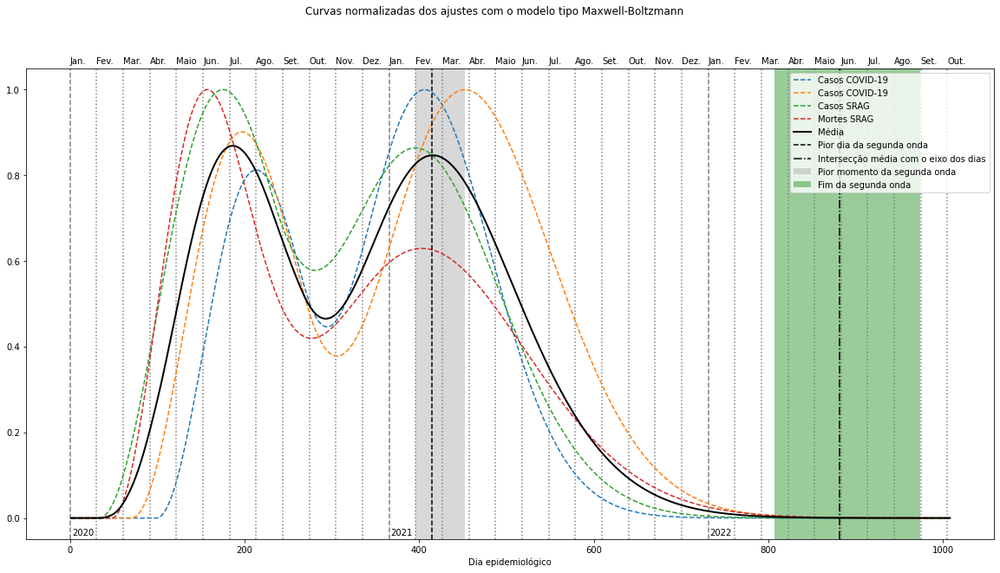
 

 **Gráfico atualizado em 21/04/2021:**

 

 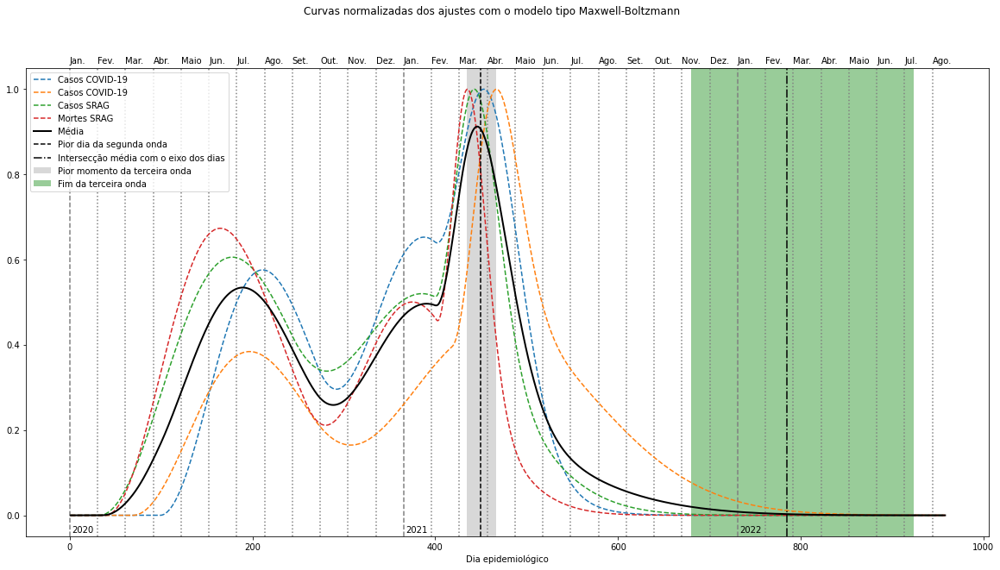
 

 
 Com estas curvas podemos obter o ponto máximo da segunda onda de cada um dos conjuntos de pontos e fazer as seguintes estimativas:
  
 (Estimativas feitas em 05/03/2021)
  
  - 9 de fevereiro (aproximadamente) foi o dia com mais casos de COVID-19 na segunda onda;
  - 27 de março (aproximadamente) será o dia com mais óbitos por COVID-19 na segunda onda;
  - 30 de janeiro (aproximadamente) foi o dia com mais casos de SRAG na segunda onda;
  - 6 de fevereiro (aproximadamente) foi o dia com mais óbitos por SRAG na segunda onda;
  - Em média, 17 de fevereiro (aproximadamente) foi o "pior dia" da segunda onda, considerando todos os fatores anteriores.
  
  *OBS: Considerando 1 de janeiro de 2020 como o primeiro dia epidemiológico do Brasil*
  
 Com estas curvas podemos obter o ponto onde há intersecção com o eixo dos dias e fazer as seguintes estimativas:
  
 (Estimativas feitas em 05/03/2021)
  
  - Em 17 de março de 2022 (aproximadamente) não haverá mais casos de COVID-19 provenientes da segunda onda;
  - Em 17 de maio de 2022 (aproximadamente) não haverá mais óbitos por COVID-19 provenientes da segunda onda;
  - Em 26 de maio de 2022 (aproximadamente) não haverá mais casos de SRAG provenientes da segunda onda;
  - Em 31 de agosto de 2022 (aproximadamente) não haverá mais óbitos por SRAG provenientes da segunda onda;
  - Em média, em 31 de maio de 2022 (aproximadamente) não haverá mais contruibuição da segunda onda em uma possível ainda decorrente pandemia, considerando todos os fatores anteriores.
  
  *OBS: Considerando 1 de janeiro de 2020 como o primeiro dia epidemiológico do Brasil*
  
 Com os ajustes feitos utilizando o novo modelo podemos realizar o somatório dos pontos até a intersecção de suas curvas com o eixo dos dias (ou fazer uma integral numérica) e obter as seguintes estimativas:
 
  - Teremos (aproximadamente) 14535182.3 casos (registrados) de COVID-19 até o fim da segunda onda.
  - Teremos (aproximadamente) 445803.6 mortes (registradas) por COVID-19 até o fim da segunda onda.
  - Teremos (aproximadamente) 1818003.9 casos de SRAG até o fim da segunda onda.
  - Teremos (aproximadamente) 490703.1 mortes por SRAG até o fim da segunda onda.
  - A taxa de subnotificação de mortes por COVID-19 (aproximadamente) até o fim da segunda onda será: 9.15%

  *OBS: Taxa de subnotificação de óbitos calculada sem subtrairmos os casos anuais de mortes por SRAG esperados por ano. O que eu calculo esporadicamente com precisão em outro repositório: https://github.com/Gremling-Machine-Learning-Study-Group/Estimativa-de-mortes-por-COVID-19-subnotificadas-no-Brasil---D051---HACKCOVID-19.*
  
  ## Estas são boas previsões acerca da segunda onda de COVID-19 no Brasil?
  
  Talvez. Provavelmente não. As causas geradoras dos pontos contidos nos *datasets* geram algo próximo de uma Distruibuição de Gauss em alguns casos (casos e óbitos registrados por COVID-19), porém, nos dados de SRAG temos uma assimetria desta "curva de distruibuição de probabilidade". O modelo novo (que eu apelidei de "tipo Maxwell-Boltzmann"), por possuir assimetria na curva de distruibuição, consegue ajustar os pontos melhor que o modelo antigo (que eu apelidei de "Gaussiano combinado"), já que o modelo novo consegue lidar melhor com esta assimetria gerada pela "explosão" incial de casos e em seu comportamento de cauda ao demorar para decrescer mais do que aumentar. Mas este melhor ajuste dos parâmetros do modelo não é garantia de que consígamos fazer boas previsões. Apesar do erro menor que o proveniente do RSME anterior, não há garantia de que esta metodologia consiga prever com exatidão o comportamento da pandemia no futuro apenas por conseguir ajustar os dados, para isto, existem metologias melhores (e bem diferentes) que são aplicadas em estudos epidemiológicos mais precisos. 
  
  Apesar disto, é possível melhorar ainda mais os resultados se criarmos modelos que utilizem curvas de distribuição de probabilidade que possibilitem assimetria bem maior, como Distruibuição Gama ou Distribuição Gama Invertida.
  
  No final das contas este não passa, pelo menos na intenção, de ser um exercício de otimização.

## Referências:

* **"MonitoraCovid-19"** https://bigdata-covid19.icict.fiocruz.br/; (Visualizado em: 05/01/2021) (Daqui foram obtidos os *datasets* utilizados.

* **"InfoGripe"** http://info.gripe.fiocruz.br/; (Visualizado em: 16/05/2020) (Onde os dados são divulgados originalmente. Daqui é possível obter *datasets* mais robustos com registros até o ano de 2009).
